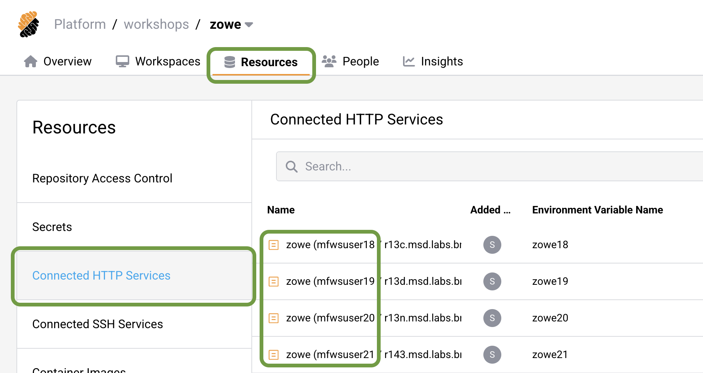
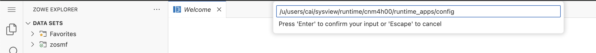

# Zowe API Integration

## Getting Started

*Imagine you’re part of a team tasked with integrating the SYSVIEW application into Zowe’s API Mediation Layer. Your goal is to make SYSVIEW's REST APIs available to external applications through Zowe’s powerful API infrastructure.*

### Browse the Zowe API Catalog UI

*Before onboarding SYSVIEW, it's useful to review the services that are already integrated with Zowe APIML. This gives you an understanding of how existing services are listed and accessed in the API catalog.*
1. Navigate to the Strong Network platform main page 
2. Go to the **Resourses** -> **Connected HTTP Services**
3. Click on the service corresponding to your user ID **zowe** **(<user>...** to open the Zowe API Catalog UI


</br></br>

You can browse the list of currently onboarded services


</br></br>

*Now that you’ve seen the catalog, it’s time to switch to your development environment. You’re working in a secure cloud IDE that runs VS Code, connected directly to the mainframe. This is where you'll do all your work. It has Zowe CLI, Zowe Explorer and TN3270 terminal emulator installed and configured.*

### Open cloud IDE

1. Return back to the the Strong Network platform main page
2. Wwitch to the **Overview** tab 
3. Click on *Running* / *Paused* button


</br></br>

The new window should pop-up, loading you into the secure cloud IDE. 

### Get familiar with the VSCode Activity Bar

</br></br>

*With the IDE set up and ready, it’s time to onboard the SYSVIEW REST API service to Zowe APIML. You’ll use Zowe Explorer to locate configuration files and modify them to point to the correct host and IP. This will enable SYSVIEW’s API to be onboarded to teh mediation layer.*

## Onboard SYSVIEW to the APIML

Let's locate the SYSVAPPS (SYSVIEW Application Server) run-time directory using Zowe Explorer.

1. Copy path to the sysview configuration to the clipboard </br>

``` 
/u/users/cai/sysview/runtime/cnm4h00/runtime_apps/config
```

2. Go to the *Zowe Explorer* extension by selecting it on the side panel. 
3. Click the magnifying lens icon under USS section - zosmf profile. </br> Please nothe that first profile verification may take up to 20 seconds.


</br></br>

4. Once validated, paste the copied path to the SYSVAPPS configuration in the input field that appears:


</br></br>

5. Wait for the USS files to load, then click on the **application.yml** file to open it.
</br> Note that the first file opening may take some time.</br>

6. In the **application.yml** file, find the **apiml** section and update the dummy host names and IP addresses with your mainframe host and IP:</br>
&nbsp;&nbsp;&nbsp;&nbsp;&nbsp;&nbsp;&nbsp;&nbsp;IP: **<zdnt-ip>**</br>
&nbsp;&nbsp;&nbsp;&nbsp;&nbsp;&nbsp;&nbsp;&nbsp;Host: **<host>**</br>


</br></br>

7.	Save the file after making the necessary changes.

### Start SYSVIEW Application Server

*At this point, the changes to the configuration are made and SYSVIEW knows where to onboard. To see those changes take effect, you need to start the SYSVIEW Application Server.*

1. Open an IDE terminal by using **Hamburger menu** -> **Terminal** -> **New Terminal** 
2. Run the following Zowe CLI command to start the SYSVIEW Application Server:

```
zowe zos-console issue command "S SYSVAPPS"
```
</br>

## Verify onboarding

*You’ve successfully updated the configuration and started the application server. Now, it's time to verify that SYSVIEW is properly onboarded and can be accessed via Zowe APIML.*

### Browse the Zowe API Catalog UI once again

It may take 5 to 10 minutes for the SYSVAPPS to start and register to the Discovery Service.</br>
If the application was configured properly we will see the SYSVIEW tile in the API Catalog. 


</br></br>

Click on the tile to drilldown to the API documentation. You can verify the service is confiugured properly by trying out some endpoint.

Select endpoint, click **Try it out**, fill in parameters if needed and click **Execute** button below


</br></br>

### Run the code snippet from IDE

Now you can reach the same endpoint from the cloud IDE using curl command.</br> 
Navigate to the IDE terminal window and paste following command there: </br></br>
 `curl -X "GET" "https://<host>:7554/casysview/api/v1/SYSVIEW/Display?command=status" -H "accept: application/json" -u <tso_user_id>:<tso_user_password>`

*You successfully onboarded SYSVIEW to the Zowe API Mediation Layer and verified it by accessing the REST API endpoint.*