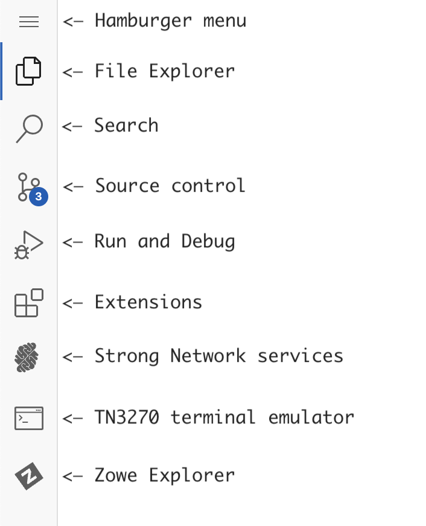

# Zowe API Integration

## Getting Started

This session is intended to describe the process of onboarding of the SYSVIEW application to the Zowe API Mediation Layer. Let's start with reviewing what services are already onboarded to the Zowe APIML.

### Browse the Zowe API Catalog UI

Navigate to the Strong Network platform main page and then go to the **Resourses** -> **Connected HTTP Services** 

  

Click on **zowe** service to open the Zowe API Catalog UI

  

### Open cloud IDE

Return back to the the Strong Network platform main page, switch to the **Overview** tab and click on *Running* / *Paused* button to open your cloud IDE

  

You are in the secure cloud environment which runs VS Code and is connected to the Mainframe

### Get familiar with the VSCode Activity Bar

  

## Onboard SYSVIEW to the APIML

Now we are gong to onboard the SYSVIEW REST API service to the APIML.

Let's connect to the Mainframe 
IP: **<zdnt-ip>** 
Host: **<host>** 
User ID: **<tso_user_id>** 
Password: **<tso_user_password>**

There are two ways to interact with the Mainframe from this environment: you can use Zowe Explorer or tn3270 terminal emulator. 

Locate the SYSVAPPS (SYSVIEW Application Server) run-time directory using Zowe Explorer.

Go tho the Zowe Explorer extension by selecting it on the side panel, then click on the magnifying lens icon under USS section - zosmf profile.

  

Input field would appear in the top part of IDE after validating the profile, paste path to the SYSVAPPS configuration:

`/u/users/cai/sysview/runtime/cnm4h00/runtime_apps/config`

  

Click on application.yml file in the USS section or the Zowe Explorer to open it. 
Find the apiml section of configuration and update it with your mainframe host and IP details and save file.

  

Now for changes to take effect we need to restart SYSVIEW Application Server. 
We can use zowe cli console command for that, open an IDE terminal by using **Hamburger menu** -> **Terminal** -> **New Terminal** and run a zowe command there:

`zowe zos-console issue command "C SYSVAPPS"`
  

## Verify onboarding
### Browse the Zowe API Catalog UI once again

If the application was configured properly we will see the SYSVIEW tile in the API Catalog

  

Click on the tile to drilldown to the API documentation. You can verify the service is confiugured properly by trying out some endpoint. Select endpoint, click **Try it out**, fill in parameters if needed and click **Execute** button below

  

### Run the code snippet from IDE

Now you can reach the same endpoint from the cloud IDE using curl command.  
Navigate to the IDE terminal window and paste following command there:   
 `curl -X "GET" "https://<ip>:7554/casysview/api/v1/SYSVIEW/Display?command=status" -H "accept: application/json" -u <tso_user_id>:<tso_user_password>`

