# Zowe API Transformation

## Getting Started

*Now that you have multiple products onboarded to Zowe’s API Mediation Layer, we are ready to build an application that utilizes them in combination. The goal is to create an app that demonstrates the power of different products like SYSVIEW and z/OSMF APIs integrated in one solution that can help you to simplify mainframe management.*

## Browse the Zowe API Catalog UI

*Let's start with reviewing the Zowe API Catalog to review what services are onboarded to the Zowe APIML.*

1. Navigate to the Strong Network platform main page 
2. Go to the **Resourses** -> **Connected HTTP Services** 
3. Click on the service corresponding to your user ID **zowe** **(<user>...** to open the Zowe API Catalog UI

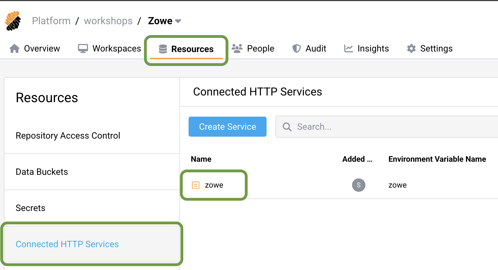
</br></br>

You can browse the list of currently onboarded services

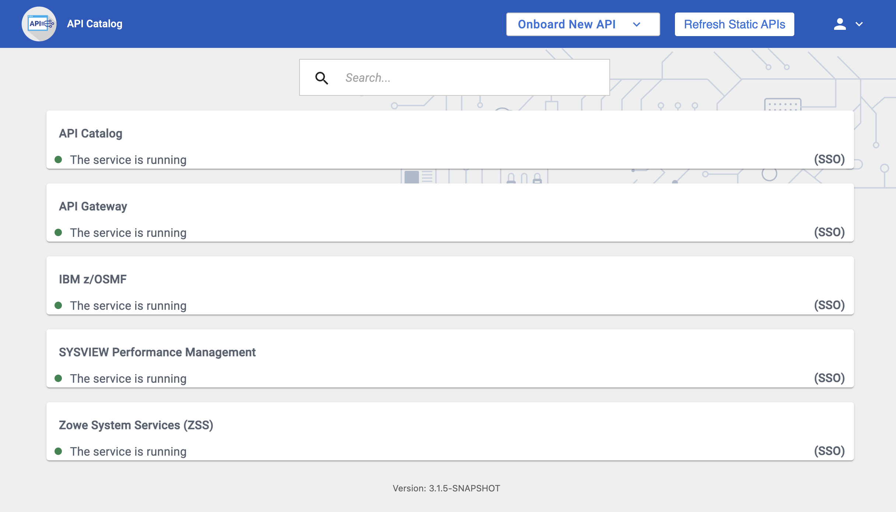
</br></br>
</br>

*The first step is to be able to execute a SYSVIEW command from within our application. To do this, we’ll use the SYSVIEW Performance Management API, specifically the /SYSVIEW/Command endpoint, which allows us to execute SYSVIEW function commands like starting a job or querying job status.*

1. Click on the **SYSVIEW Performance Management** tile to drilldown to the API documentation and browse available endpoints</br>
2. Browse the available endpoints, and select **/SYSVIEW/Command** 

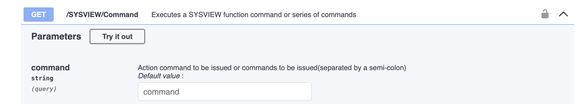
</br></br>

3. Click **Try it out**.
4. Enter **/S ZWEDUMMY** value to the *command* field.
5. Click on **Execute** button below.</br>

You should see the Server response code **200** and some content.</br></br> 

*Once the endpoint is executed successfully, you’ll see a set of reusable code snippets in different languages. For our demo, we’ll use NodeJS. These snippets will allow us to integrate the SYSVIEW API functionality into our application.*

1. Click on the NodeJS tab on snippets panel 
2. Copy the code content.

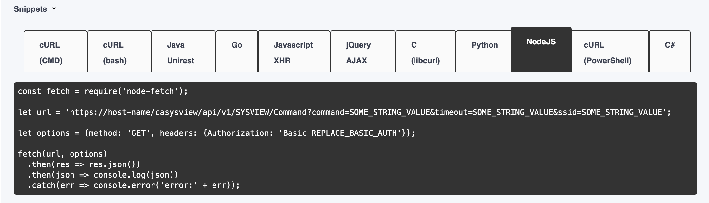
</br></br>

## Develop the application

*Now, it’s time to develop the application itself. We’ll use the cloud IDE to write the code that connects to both SYSVIEW and z/OSMF. IDE is connected directly to the mainframe. It has Zowe CLI, Zowe Explorer and TN3270 terminal emulator installed and configured.* 

### Open cloud IDE

1. Return back to the the Strong Network platform main page
2. Switch to the **Overview** tab 
3. Click on *Running* / *Paused* button to open your cloud IDE

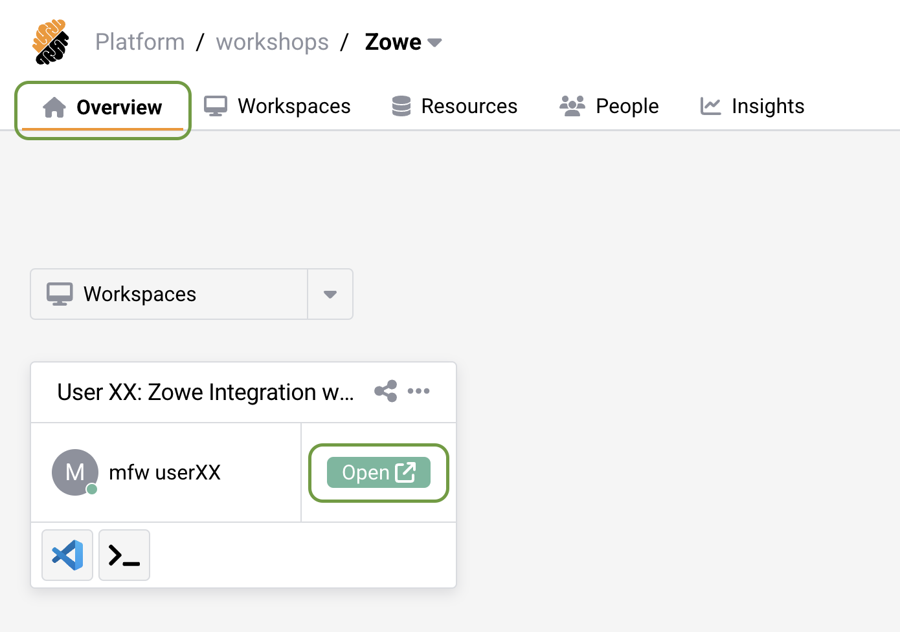
</br></br>

The new window should pop-up, loading you into the secure cloud IDE. 

### Get familiar with the VSCode Activity Bar
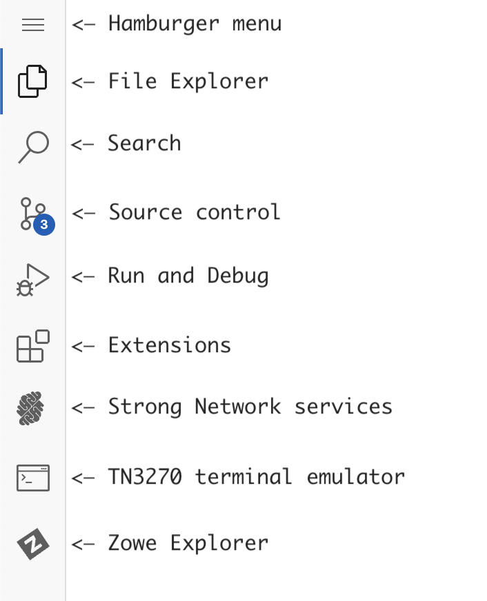
</br></br>

### Update SYSVIEW service

Our app is located in the **application** folder, and REST API services are stored in **services** folder.  

1. Using File Explorer navigate to the **application** -> **services** folder 
2. Open **sysview.js**
3. Paste the snippet code below the green commented out line. It should look similar to this:

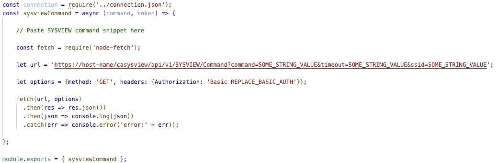
</br></br>

Although some code snippets are ready to use, this one requires some adjustments for our demo environment.</br> Let's make a few changes to make it work with our application.

1. Update URL so it is not using hardcoded connection details and command value:
```javascript
    let url = `${connection.scheme}://${hostname}:${connection.zowePort}/casysview/api/v1/SYSVIEW/Command?command=${command}`;
```

2. Authorization token for our application is stored in **token** variable and should be passed as 'Cookie' with the request. Update headers to include 'Cookie' with token:
```javascript
    let options = {method: 'GET', headers: {'Content-Type': 'application/json', 'Cookie': token}};
```

3. Code snippet prints request output to the console, while we need to return it from the function, add **return** keyword before fetch function, and remove the last two lines:

```javascript
    return fetch(url, options)
        .then(res => res.json());
```

Save the file, now it should look similar to this:

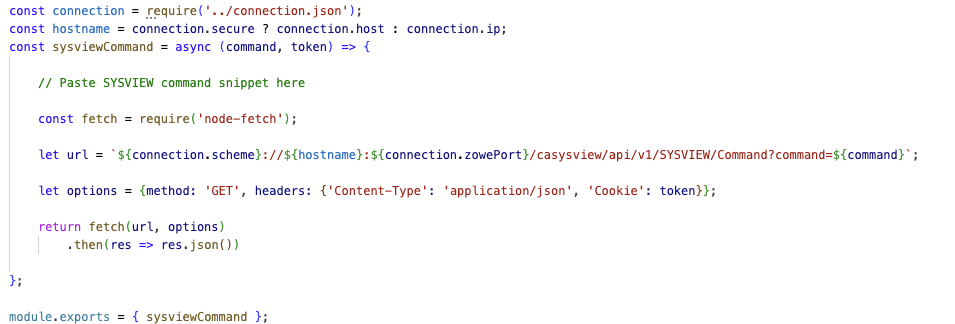
</br></br>

### Update z/OSMF service

To unlock the actual value of API Mediation Layer we can combine multiple different products in our application. Lets use z/OSMF rest API to get the list of jobs as an example.</br>

1. Navigate back to the API Catalog and switch to the z/OSMF API's documentation.

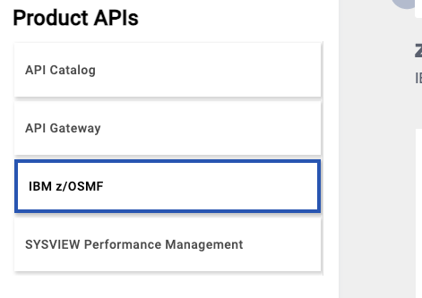
</br></br>

2. Find **Jobs APIs** and open **/zosmf/restjobs/jobs** endpoint description</br>
3. Click **Try it out** 
4. Type down a wildcard * as an owner and **ZWEDUMMY** as a prefix 

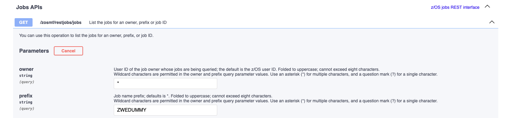
</br></br>

5. Scroll down and click **Execute** button
6. Open a NodeJS snippet and copy the code

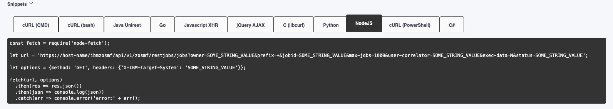
</br></br>

Return to the cloud IDE and repeat the steps we performed for the previous service: 

1. In the File Explorer navigate to the **application** -> **services** folder 
2. Open our second service - **zosmf.js**</br> 
3. Paste the snippet code below the green commented out line

4. Update URL so it is not using hardcoded connection details and prefix value:
```javascript
    let url = `${connection.scheme}://${hostname}:${connection.zowePort}/ibmzosmf/api/v1/zosmf/restjobs/jobs?owner=*&prefix=${prefix}&max-jobs=1000&exec-data=N`;
```

5. Authorization token for our application is stored in **token** variable and should be passed as 'Cookie' with the request. Update headers to include z/OSMF specific header "X-CSRF-ZOSMF-HEADER" and 'Cookie' with token:
```javascript
    let options = {method: 'GET', headers: {
                "X-CSRF-ZOSMF-HEADER": "",
                'Content-Type': 'application/json',
                'Cookie': token
            }};
```

6. Code snippet prints request output to the console, while we need to return it from the function, add **return** keyword before **fetch** function, and remove the last two lines:

```javascript
    return fetch(url, options)
        .then(res => res.json());
```
</br>

*Now that both the SYSVIEW and z/OSMF services are integrated, it’s time to run the application. This app will automate job management, checking job statuses every 10 seconds and taking action when necessary. Let’s start the application and see it in action.*

### Start the application

Open an IDE terminal by using **Hamburger menu** -> **Terminal** -> **New Terminal** and run a node command there:

```
node application/server.js 
```
</br>Console should reply that server is running</br>

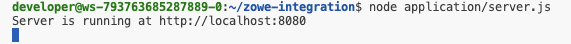
</br></br>

Also, a popup message should appear in the right bottom corner, click on **Create App** (Or **Preview** if application already exists)

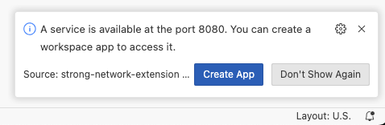
</br></br>

Fill in any application name, select **Public** access and click **Create**

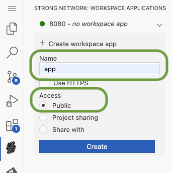
</br></br>

This will provide us access to the user interface of our application. </br>Click browse icon to open the UI.

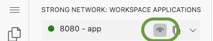
</br></br>

You should be able to see our ZWEDUMMY Monitor demo application.

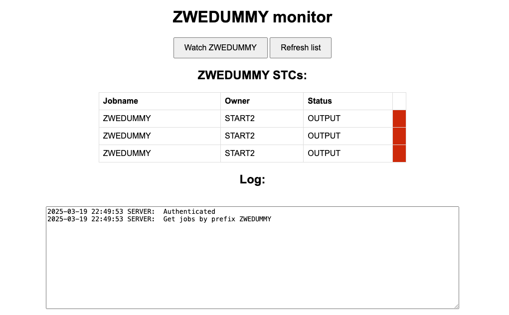
</br>

*The application is now live. The ZWEDUMMY Monitor demo application is designed to monitor jobs and trigger SYSVIEW commands as needed. If a ZWEDUMMY job is not running, the app will automatically start it for you.*

### Workflow in details:

The ZWEDUMMY is a sample STC that does nothing, just sleeps for a few minutes and then stops.

Our application will start with authenticating the user and obtaining a token which will be used with every REST API request to connect to any product onboarded to the APIML.

Then it triggers the z/OSMF jobs REST API to get the list of jobs with prefix "ZWEDUMMY".

If you were quick enough, one ZWEDUMMY STC may be still running as we have issued /S ZWEDUMMY sysview command in the API Catalog earlier.

If nothing is running, no worries, click on **Watch ZWEDUMMY** button and the app will fix that.</br>
Every 10 seconds our app will check the list of running jobs and in case there is no ACTIVE ZWEDUMMY then it will automatically start one using SYSVIEW /S ZWEDUMMY command.

*Congratulations, you’ve now developed an application that combines the capabilities of SYSVIEW and z/OSMF APIs through the Zowe API Mediation Layer. The power of Zowe’s extensibility has made it possible for you to leverage REST APIs in ways that were previously unavailable on the mainframe.*